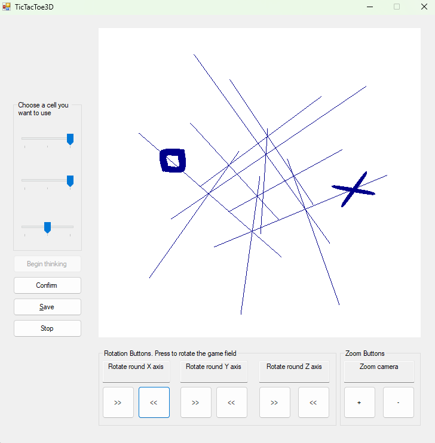

# TicTacToe3D

That's a hobby project that i did in 2008 or so, which is, as the title says, a game of Tic Tac Toe in 3D, 
written in C# with the Windows Forms technology, which uses a custom self-written 
minimal graphical engine that displays 3D through 2D Windows Forms primitives (like "draw a line" and "draw a contour"). 

The user interface is not stellar, but shall be more or less straightforward to understand, as well as the rules.

One caveat in the rules: the second player can make one more turn after the first player wins.

# Impression

It looks like this:

# Technical details

I think I was following 
[Rogers, Adams (1989) Mathematical Elements for Computer Graphics](https://www.amazon.de/-/en/J-Alan-Adams/dp/0070535302) 
back then and maybe [Rogers (1997) Procedural Elements for Computer Graphics](https://www.amazon.de/-/en/David-F-Rogers/dp/0070535485), 
the two books I happened to have nearby.

It implements the minimal pipeline: model, view, and projective matrices, clipping, 
drawing of certain primitives and planar objects from images, but no diffusion, lighting, etc.

I also didn't know Model-View-ViewModel, Model-View-Presenter, or Model-View-Controller back then, 
so the code doesn't have them. But the code has OOP, 
abstract classes, design patters, unit tests, and the pipeline pattern for the graphics pipeline. 
Maybe Inversion of Control, but i am not sure. 

